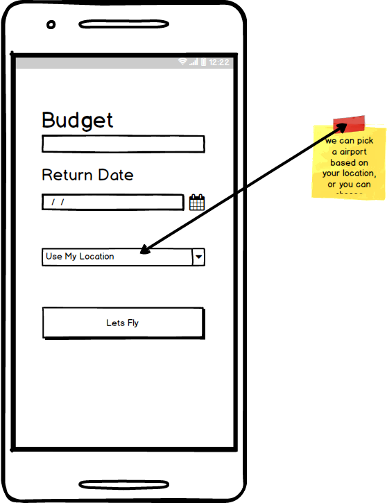
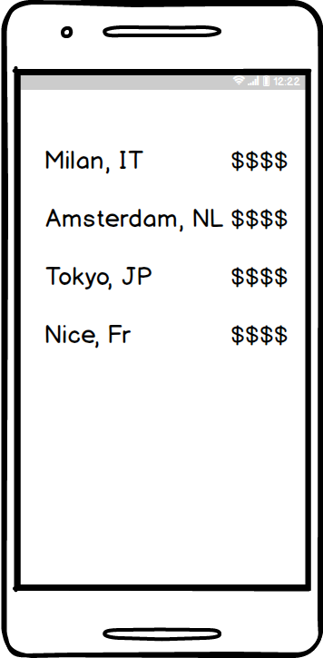

# Leave-Now

## Motivation

While the market is already saturated with airline booking applications, the majority of them focus on either booking a specific flight, or finding the lowest-priced flight available for a certain time period. However there is a growing section of users who search for flights leaving immediately, with less regard for price or date. LeaveNow fills this niche for spontaneous users, who want a destination-agnostic, moderately priced international flight that leaves as soon as possible.

## Minimum Viable Product

Using LeaveNow, users will be able to:

- [ ] See a destination-agnostic list of round-trip international flights departing from their nearest airport within the next 12 hours,
- [ ] Filter this list by price,
- [ ] See a detailed view of specific information after selecting a trip,
- [ ] Access an airline's booking page through this detailed view.

<<<<<<< HEAD
##WireFrames

##Technologies & Technical Challenges
=======
## Technologies & Technical Challenges

There will be three pages:
  - Splash/loading page
  - Home: receive user input
  - Flight Index: list of all relevant flights
  - Flight Show: flight details

The primary technical challenges will be:
  - Parsing the api data to display the relevant flights
  - Storing the search results in the state to limit api requests when viewing the details of different options
  - Only displaying flights departing within the next 12 hours of the current time

The user will select a max price, return date, and airport. The app will send a request to the Skyscanner API (adding the current date and time). It will then parse the returned data to only include flights within the next 12 hours.

## Group Members & Work Breakdown

Our group consists of three members: Craig Scott, Chris Bryd, Maria Belgrader

Each team member will be responsible for:
  - Researching and understanding the Skyscanner API
  - Selecting a splash/loading image and color palatte

Craigs's primary responsibilities will be:
  - Setting up the Skyscanner API
  - Researching geolocation with Skyscanner (zipcode)
  - Home page with styling

Chris's primary responsibilities will be:
  - Setting up the application state
  - Show page with styling

Maria's primary responsibilities will be:
  - Setting up pages and routes
  - Index page with styling

## Implementation Timeline

**Day 1**: Setup environment & select color scheme (Team Day)
  - Basic Setup
    - React Native
    - Redux
  - Choose Color Scheme:
    - Each person picks a splash image and color palatte

**Day 2**: Setup API, state, and pages
  - Get familiar with Skyscanner API (T)
  - Setup API (CS)
    - Research geolocation Skyscanner option(zipcode)
  - Setup application state (CB)
  - Setup pages (MB)

**Day 3**: Build out pages with details and style
  - Home (CS)
  - Index (MB)
  - Show (CB)
  - Splash/Loading (T)

**Day 4**: 9am Team meeting to finish up features and launch to ios/andriod stores
  - Styling
  - Error handling
  - Wrap up outstanding features
  - Push to the App Store and Google Play

**Day 5**: Final touches and bonus features (Team Day)
  - Polish and look for bugs
  - Decide on bonus features and begin implementation

**Bonus Features (TBD)**:
  - [ ] Weather of destination
  - [ ] Geolocation to find all nearby airports
  - [ ] Optional no layover
  - [ ] Images of destination
  - [ ] Cesium globe on show page with pin for destination
