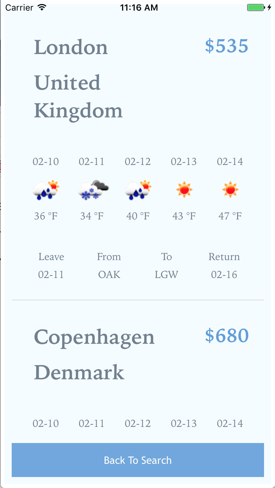

# GetAway

[Live][website]

[website]: http://www.findmyjourney.com/

## Minimum Viable Product

- [x] Use geolocation to find the user's closest airport.
- [x] Return a list of round-trip flights leaving from that airport in the next 24 hours.
- [x] Show a 5-day weather forecast for each destination.
- [x] Redirect users through an affiliate link to a site where they can book the flight of their choice.

## Motivation

While the market is already saturated with airline booking applications, the majority of them focus on either booking a specific flight, or finding the lowest-priced flight available for a certain time period. However there is a growing section of users who search for flights leaving immediately, with less regard for price or date. LeaveNow fills this niche for spontaneous users, who want a destination-agnostic, moderately priced flight that leaves as soon as possible.

## The App

The app was coded in React Native, using es2016 transpiled through babel. Redux was used to handle the information from asynchronous API calls by incorporating it into a global state. Three different API services were used in the functionality of the app: SkyScanner, OpenWeatherMap, and Developer.areo. Everything is combined and presented in such a way as to provide a seamless experience for the end-user.

<p align="center">
  
</p>

<p align="center">
  
</p>

## Features and Implementation

This app is comprised of two distinct components, `Home` and `FlightIndex`.

### Home

[Home.js][home]

The `Home` component is responsible for: obtaining the user's geolocation data, finding the closest airport to the user, and making a successful query to the SkyScanner API. The closest airport is fetched on the `componentDidMount()` lifecycle method by querying the Developer.areo API with the user's geolocation data. The local state is then updated with the `componentWillReceiveProps()` method.

```javascript

  componentDidMount() {
    navigator.geolocation.getCurrentPosition(position => {
      let lat = position.coords.latitude;
      let long = position.coords.longitude;
      this.props.fetchClosestAirport(lat, long);
    });
  }

  componentWillReceiveProps(newProps) {
    this.state.nearestAirport = newProps.nearestAirport.code;
  }

```

### FlightIndex

[FlightIndex.js][FlightIndex]

`FlightIndex` is more complex than the `Home` component. Its purpose is to receive the response from the SkyScanner API query, make a successive query to OpenWeatherMap's API using each destination's location data, and parse this information in an easy-to-read way. Because the weather data is mapped to each flight after the SkyScanner API call is made, `getWeather()` must be called with a concurrent boolean of `gotWeather` during `componentWillReceiveProps()`, to keep React from getting caught in an update loop.

```javascript

  componentWillReceiveProps(newProps) {
    // Flights
    newProps.flightIndex.Quotes.forEach(quote => {
      this.state.quotes.push(quote);
    });
    this.state.places = newProps.flightIndex.Places;
    this.state.returnDate = newProps.returnDate;
    this.parseIndexDetails();
    // Render
    this.setState({ dataSource: this.state.dataSource.cloneWithRows( this.state.indexFlightInfo ) });
    this.setState({
      visible: false
    });
    // Weather
    this.getWeather();
    this.state.weather = newProps.weather;
    this.incorporateWeather();
  }

  getWeather() {
    if(!this.state.gotWeather) {
      this.state.indexFlightInfo.forEach(function(obj){
        this.props.getForecast(obj["Arrival City"], obj["Arrival Country"]);
      }, this);
    }
    this.state.gotWeather = true;
  }

  incorporateWeather() {
    this.state.indexFlightInfo.map(function(obj){
      let rObj = obj;
      rObj["weather"] = this.state.weather[obj["Arrival City"]];
      return rObj;
    }, this);
  }

```

[home]: ./components/home/home.js
[flightIndex]: ./components/flights/flightIndex.js

## Future

There are several features that will be added to this project in the future.

- While obtaining the weather data for each destination seemed straightforward during the planning stage, it has grown sufficiently complex enough to warrant refactoring into its own component.

- The API request for closest airport can be changed to find all the airports in a certain-mile radius. Getting automatically routed to Oakland airport from San Francisco can be annoying.

- A stock photo API can be incorporated to include basic photos of each destination.

- To make the more visually appealing, a Cesium globe could be incorporated.

- The option for direct-only flights can be included.

- Currently the app is iOS only. Android will be incorporated in the near future.
